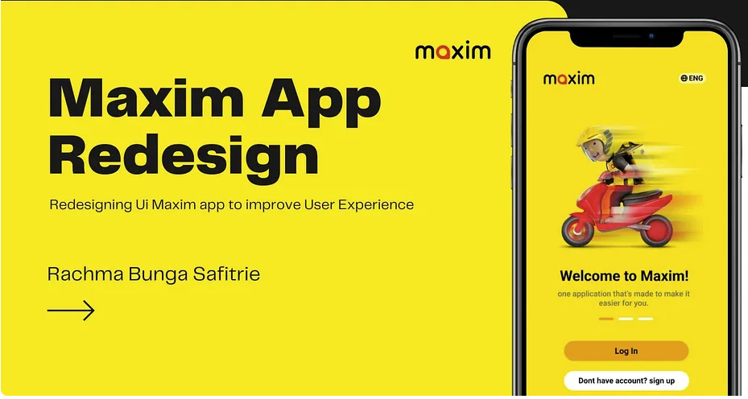
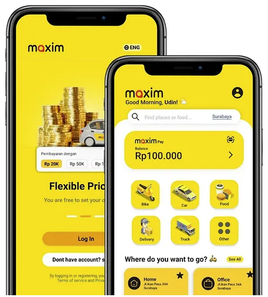
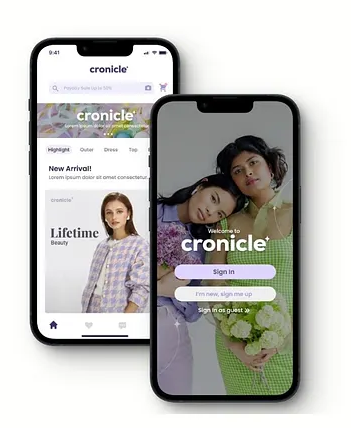
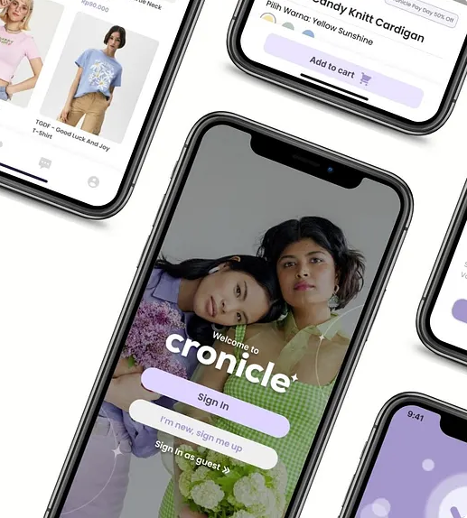
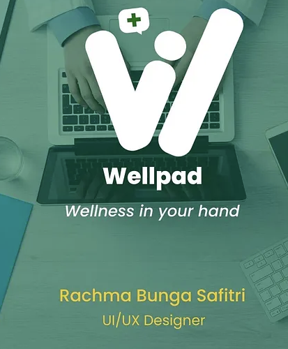
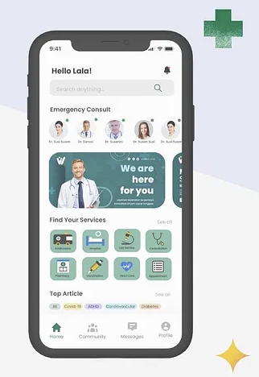
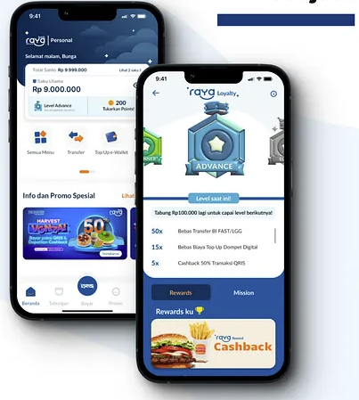
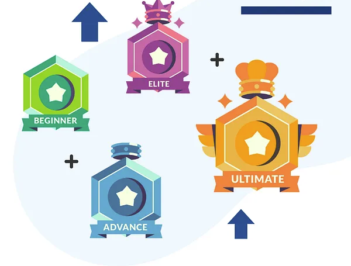

# Portfolio Brief — Rachma Bunga Safitri

> **Context for future me (the animation agent):** This document is my own intake note. The designer (Rachma) handed me a set of Dribbble shots and asked me to turn them into a scroll-morph hero animation (the kind where a single hero artwork morphs/transforms as the user scrolls, inspired by the 21st.dev `scroll-morph-hero` reference). Below is everything I need to know about each piece before I start choreographing frames.

---

## Designer snapshot

- **Name:** Rachma Bunga Safitri
- **Role:** UI/UX Designer
- **Portfolio:** https://dribbble.com/bungaracma
- **Signature traits I observed:** bold single-color brand fields (yellow, lavender, teal, navy), mobile-first mockups shown on iPhone frames, friendly illustrative icon sets, clean sans-serif typography, strong use of whitespace and rounded cards.

These traits matter for the morph animation — each scroll "stop" should lean into the dominant color and hero shape of the source shot so transitions feel like brand shifts, not random screen swaps.

---

## Project 1 — Maxim App Redesign

**Screenshots:** [maxim-1.png](./maxim-1.png), [maxim-2.png](./maxim-2.png)




- **Type:** Mobile super-app redesign (ride-hailing + delivery + payments).
- **Brand language:** Saturated Maxim yellow (#F7D417-ish), black type, illustrative service icons (bike, car, food, delivery, truck).
- **Key screens captured:**
  - Cover frame with scooter-rider illustration and "Welcome to Maxim!" CTA stack.
  - Home dashboard with Maxim Pay balance card, 6-tile service grid, and saved places.
  - Flexible Pricing screen (Rp 20K / 50K / 100K pills) with a gold coins + car illustration.
- **Animation hooks:** the yellow field is a perfect "stage" color; the scooter illustration and the coin stack are natural hero objects that can scale/rotate as the scroll-morph focal point. Service icons can pop in as a grid reveal at the end of this segment.

---

## Project 2 — Cronicle Fashion App

**Screenshots:** [cronicle-1.png](./cronicle-1.png), [cronicle-2.png](./cronicle-2.png)




- **Type:** Fashion / apparel e-commerce mobile app.
- **Brand language:** Soft lavender (#C8B6E2-ish) with warm cream, lowercase wordmark "cronicle", lifestyle photography of two models as the hero, pill-shaped "Sign in" / "Sign up" buttons.
- **Key screens captured:**
  - Welcome screen dominated by a duo-model photo behind a translucent lavender panel.
  - Product browse screen with category tabs (Highlight / Women / Dress / Top) and a "New Arrival!" section titled "Lifetime Beauty".
  - Product detail card for "Vindy Knit Cardigan – Yellow Sunshine" with an "Add to cart" button.
- **Animation hooks:** the two-model portrait is the strongest hero image in the whole portfolio — ideal for the "hero stays, background morphs" trick. Lavender → yellow is a great cross-project color transition if I sequence Cronicle before or after Maxim.

---

## Project 3 — Wellpad (Health / Wellness)

**Screenshots:** [wellpad-1.png](./wellpad-1.png), [wellpad-2.png](./wellpad-2.png)




- **Type:** Telehealth / wellness mobile app. Tagline: *"Wellness in your hand."*
- **Brand language:** Deep teal green (#2F6A6A-ish) with soft off-white, medical cross "+" motif, stylized "W" logomark built from a checkmark/heart shape.
- **Key screens captured:**
  - Cover lockup: logo + tagline over a desaturated photo of hands on a laptop (doctor consultation vibe).
  - Home screen: "Hello Lala!" greeting, Emergency Consult doctor avatars row, a teal promo card ("We are here for you"), a Find Your Services icon grid, and a Top Article chip list (Covid-19, ADHD, Cardiovascular, Diabetes).
- **Animation hooks:** the medical "+" glyph and the rounded service tiles are great for particle/icon-burst effects. Teal provides a calm midpoint between the loud yellow (Maxim) and the playful navy (Raya).

---

## Project 4 — Raya Loyalty Program

**Screenshots:** [raya-1.png](./raya-1.png), [raya-2.png](./raya-2.png)




- **Type:** Banking / e-wallet loyalty & rewards feature (Raya).
- **Brand language:** Deep navy blue (#0B2A5B-ish) with bright accent gradients, gamified gem/badge illustrations, Indonesian-language copy ("Selamat malam, Bunga", "Tabung Rp9.000.000 lagi untuk capai level berikutnya").
- **Key screens captured:**
  - Personal dashboard showing Rp 9.000.000 balance, 200 Tabuan Promo points, promo carousel (HARVEST / Diskon Transfer FAST/LLG), and bottom tab bar.
  - Loyalty tier detail: Advance badge highlighted, progress toward next tier, Rewards & Mission tabs, Cashback promo card.
  - Standalone illustration of the four loyalty tiers: **Beginner** (green), **Advance** (blue), **Elite** (pink/magenta with crown), **Ultimate** (gold with wings + crown), arranged with "+" operators and upward arrows suggesting progression.
- **Animation hooks:** this is the most *kinetic* asset in the set. The four tier gems are ready-made morph targets — I can let them fly in one-by-one as the scroll progresses and crown them into "Ultimate" as a climactic frame. Great closer for the reel.

---

## Locked choreography (confirmed with Rachma)

Treating the reference component (scroll-morph hero) as the spec, and applying Rachma's direction (2026-04-18):

**Playback mode:** **hybrid** — scroll-locked on first pass (each scroll tick advances the morph, matching the 21st.dev reference), then **loops** automatically when the user reaches the bottom and keeps scrolling or idles at the outro.

**Persistent element:** Rachma's wordmark — *"Rachma Bunga Safitri / UI/UX Designer"* — stays **pinned in a fixed corner (top-left) across every frame**, only fading in at the intro and doing a subtle scale/glow at the outro. It never leaves the stage between frames.

**Sequencing rule:** ordered by **color harmony**, not chronology. The palette must flow as a single gradient story — no jarring jumps. Transitions blend the outgoing hue into the incoming hue (crossfade through a shared midpoint color), never hard-cut.

### Locked color arc

```
lavender ─► teal ─► navy ─► yellow(gold-accented)
Cronicle    Wellpad  Raya     Maxim
```

Why this order (revised from my first draft for consistency):
- **Lavender → Teal:** both are desaturated cool pastels — a gentle, almost analogous shift.
- **Teal → Navy:** same cool family, just deepening in value. Reads as "diving deeper."
- **Navy → Yellow:** this is the only warm/cool jump — intentionally placed at the climax so Maxim's yellow feels like sunrise after the deep navy. Gold accents from Raya's *Ultimate* tier pre-seed the yellow so the transition has a chromatic bridge instead of a hard cut.

### Frame timeline

1. **Frame 0 — Intro.** Neutral off-white stage. Wordmark fades in top-left and pins. Small prompt: *"scroll to explore".*
2. **Frame 1 — Cronicle (lavender).** Stage washes to lavender. Duo-model portrait slides up as hero; "cronicle" wordmark settles; product card ("Vindy Knit Cardigan") floats in.
3. **Frame 2 — Wellpad (teal).** Lavender deepens/desaturates into teal. Medical "+" glyph assembles from particles; doctor-avatar row fans out; service icon grid settles.
4. **Frame 3 — Raya (navy) — EMPHASIZED.** Teal darkens to navy. **This is the hero beat of the reel** (longer dwell, more sub-frames):
   - 3a: Raya dashboard slides in with Rp 9.000.000 balance card.
   - 3b: Camera pushes into the loyalty-tier illustration.
   - 3c: Tier badges march in one-by-one — **Beginner → Advance → Elite → Ultimate** — each with a small "+" burst and upward-arrow cue.
   - 3d: Crown lands on Ultimate; wings unfurl; gold sparkles emit (these sparkles are the chromatic bridge into Frame 4).
5. **Frame 4 — Maxim (yellow).** Gold sparkles from Raya expand and flood the stage into Maxim yellow. Scooter illustration rides in; service icon grid (bike / car / food / delivery / truck / other) snaps into place; coin-stack + pricing pills resolve last.
6. **Frame 5 — Outro.** All four brand hues collapse behind the pinned wordmark. Wordmark does a subtle scale + glow. CTA appears: *"View full portfolio →"* linking to https://dribbble.com/bungaracma. After a short hold, loop restarts at Frame 1.

### Dwell-time budget (relative weights)

| Frame | Project  | Weight | Notes |
|-------|----------|--------|-------|
| 0     | Intro    | 0.5×   | Quick, just enough to register the wordmark. |
| 1     | Cronicle | 1.0×   | Standard beat. |
| 2     | Wellpad  | 1.0×   | Standard beat. |
| 3     | **Raya** | **2.0×** | **Emphasized** — longest dwell, 4 sub-frames (3a–3d). |
| 4     | Maxim    | 1.0×   | Standard beat, but the transition *into* it (gold→yellow) is the reel's signature moment. |
| 5     | Outro    | 0.75×  | Brief hold before loop restarts. |

---

## Assets inventory (local paths)

| Project  | Files |
|----------|-------|
| Maxim    | [maxim-1.png](./maxim-1.png), [maxim-2.png](./maxim-2.png) |
| Cronicle | [cronicle-1.png](./cronicle-1.png), [cronicle-2.png](./cronicle-2.png) |
| Wellpad  | [wellpad-1.png](./wellpad-1.png), [wellpad-2.png](./wellpad-2.png) |
| Raya     | [raya-1.png](./raya-1.png), [raya-2.png](./raya-2.png) |

All assets live in [data/work/](./). No external downloads required — everything I need to key the scroll-morph frames is already on disk.

---

## Resolved direction (2026-04-18)

All four open questions have been answered by Rachma:

1. **Playback:** hybrid — scroll-locked on first pass, loops afterward. ✅
2. **Wordmark:** pinned top-left across every frame, not just intro/outro. ✅
3. **Sequencing:** by color harmony, not chronology. Color arc tightened for consistency → **Lavender → Teal → Navy → Yellow**. ✅
4. **Emphasis:** **Raya** is the hero beat — 2× dwell weight, broken into 4 sub-frames (3a–3d) climaxing on the Ultimate tier crown/wings. ✅

No open questions remaining. Choreography is locked; ready to cut keyframes.
